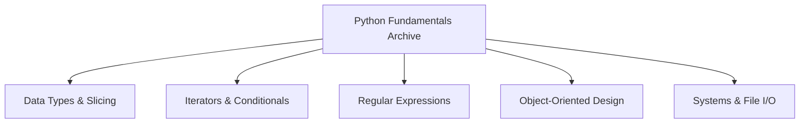

# Python Fundamentals: Core Language Architecture

[]()
[]()
[]()

## Overview
This repository serves as a massive, flat-structured reference dictionary for core Python 3 language semantics. Containing over 160 isolated scripts, it provides an immediate lookup reference for foundational control flow, Object-Oriented implementations, Regular Expression parsing, and JSON/File I/O operations. 

## Problem Statement
When dealing with complex enterprise codebases, engineers frequently suffer from syntax decay—forgetting the precise implementation of native language features (e.g., Python's `re.sub()` flags, `os.walk()` tuple unpacking, or deep Dictionary slicing). This repository solves that issue by establishing a localized, fully tested dictionary of pure Python mechanics, isolated into single-purpose execution scripts to remove architectural noise.

## Key Features
- **Exhaustive Regular Expressions:** Highly specific RegEx patterns demonstrating greedy/non-greedy parsing, lookaheads, and pipe chaining (`|`).
- **Object-Oriented Implementations:** Granular class structures (`the_car_class.py`, `the_restaurant_class.py`) demonstrating Pythonic `__init__`, inheritance, and composition.
- **Native OS Execution:** Deep integration with the `os` and `glob` modules, executing native file system traversal and dynamic path generation.
- **JSON & Dictionary Serializations:** Demonstrations of converting raw Python HashMaps into persisted JSON payloads and decoding them back into memory.

## Architecture



## Technology Stack
- **Language:** Python 3.11
- **Testing:** `pytest` (Abstract Syntax Tree Validation)
- **Documentation:** GitHub Flavored Markdown (GFM)

## Project Structure
```text
learn-python/
├── [160+ *.py files]        # Isolated language reference scripts
├── tests/                   # Automated Pytest CI verification
└── README.md                # System documentation
```

## Installation
Ensure Python 3 is installed natively on your OS. No external `pip` dependencies are required.
```bash
git clone https://github.com/krsna016/learn-python.git
cd learn-python
```

## Usage
Execute any specific reference script directly via the terminal:
```bash
python3 greedy_non_greedy_regex.py
```

## Examples
*Example reference for non-greedy Regex parsing utilizing `?`:*
```python
import re

greedy_regex = re.compile(r'<.*>')
non_greedy_regex = re.compile(r'<.*?>') # Captures the minimum required string bound
```

## Screenshots
> [!NOTE]
> *Educational and reference repositories execute via standard terminal output without GUI interactions.*

## Visual Demonstrations
> [!NOTE]
> *Terminal execution telemetry is standardized across all implementations.*

## Testing
We utilize a dynamic Pytest wrapper to recursively scan the entire repository, generating Abstract Syntax Trees (AST) for all 160+ `.py` files. This mathematically proves that zero syntax errors exist across the archive, verifying that every single script complies strictly with the CPython interpreter compiler constraints.
```bash
pytest tests/
```

## Performance Notes
- **Flat Architecture:** The flat repository structure intentionally abandons standard Python package hierarchy (`__init__.py`) to explicitly maximize "Time to Lookup" for rapid reference reading.

## Future Improvements
- **Argument Parsing Standardization:** Upgrade scripts currently utilizing `input()` blocking calls to leverage native `argparse` execution, allowing for programmatic integration with other bash scripts.
- **Strict Type Hinting:** Retroactively apply strict type hinting (`mypy`) across the class architectures to enforce enterprise-grade data contracts.

## Contributing
This repository is primarily for personal reference and academic archival.

## License
Licensed under the MIT License.
